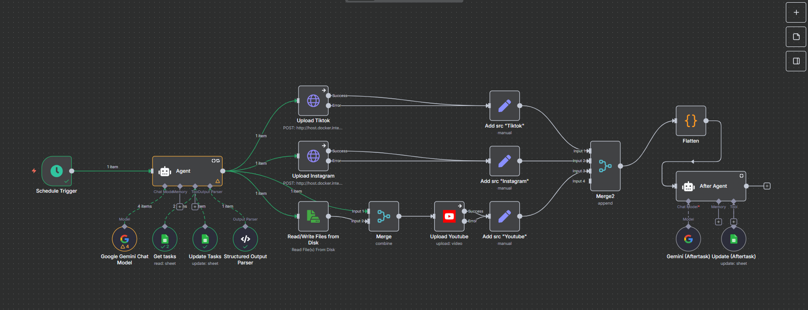

# Social Media Scheduler Automation (n8n Workflow)

At the beginning I want to be a clipper, more precise for tier-1 Valorant scenes. I prep the clips, download the video, slap a subtitle, crop the video and export it. Then I need to upload these clip once per day at certain time, because that's what the algorithm is (everyone said that).

I plan to upload my clips on Tiktok, Instagram and Youtube automatically, therefore I did research on management content platform like Buffer or Mixpost, it doesn't satisify my requirement, like Mixpost only offer to upload only to Facebook in their free-tier. Then there are also alternative used by many like Blotato or Upload-Post, while these platform doesn't have scheduler on its own, these tools used with n8n, a workflow orchestrator. So these tools is a bad choice too but n8n itself was okay.

N8N itself only natively support "Youtube", mean I can only build myself a service to for Tiktok and Instagram. You can found these two at separate repositories, either a simple library or selenium wrapped in Fast API. Especially for selenium-based solution, it was extremely volatile to changes.

"Why not use official Tiktok and Instagram API?", the simple answer is the length of process I need to go through to gain the access. However, I work on that while working with this, I want to see the result as soon as possible.

## Usage

Import the workflow to your running n8n instance.

## Pre-Workflow Steps

1. Download the video with `yt-dlp`, you can use it more than just download because it is equipped with ffmpeg.

2. Edit it with `Capcut Desktop`, automatic captioning, crop the clips and export it to preferable format. 

3. Personally I just mount the export folder to the containers (n8n or other services), but you can use Google Drive or any S3-compatible storage.

## Workflow Steps

1. **Task Discovery**
   - Use the `Get tasks` node to find all video clips in the spreadsheet where the `status` column is empty.

2. **Conditional Branch**
   - If no clips are found, skip to step 5.
   - If clips are found, proceed to content generation.

3. **Content Generation**
   - For each discovered clip, use the `Google Gemini Chat Model` node to generate a `title` and `caption`.

4. **Spreadsheet Update**
   - Use the `Update Tasks` node to update each row with the generated `title`, `caption`, and set `status` to `labelled`.

5. **Next Clip Selection**
   - Use the `Get tasks` node again (with `Return_only_First_Matching_Row` set to true) to select the next labelled clip.

6. **Output (Agent AI)**
   - Output a single object containing: `filename`, `title`, `description`, and `tags` (formatted as hashtags, e.g., `#shorts`, `#valorant_champion`).

7. **Upload Process**
    - Push the input to Tiktok-Uploader service with Form-Data
    - Push the input to igpost service with Form-Data
    - Read the video file and push it to Youtube

8. **Add Identifier and Flatten**
    - Each output from upload node given an identity "source" then flatten with Function Node so the "After Agent AI" could process it all at once in single call.

9. **After Agent AI**
    - Lastly with the help of Gemini, automatically update the Spreadsheet about the lastest status of each upload and overall status process.

## Customization

- Update spreadsheet URLs, credentials, or node parameters as needed for your environment.
- Extend or modify nodes to fit additional processing requirements.

## Implementation

See `local-scheduler.json` for a concrete implementation.
